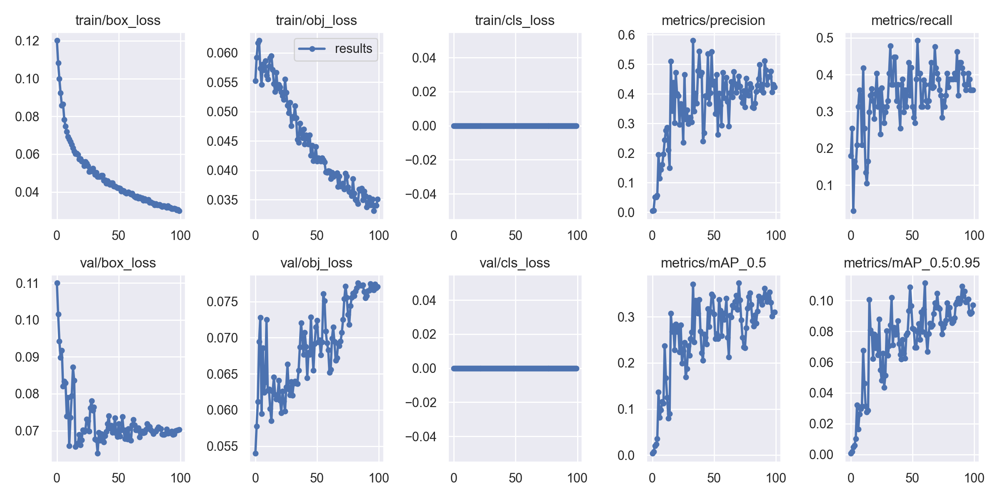

# Results and verification

## Original thesis experiments

Source: Haonan Yin's 2025 graduation thesis, *Design and Implementation of a Deep Learning-Based Fire Source Recognition and Localization System*, Sections 4.1 and 5.1-5.4. The complete thesis is retained in the author's private archive because it includes university and personal information.

The reported computing platform was an Intel Core i7-10875H, 16 GB RAM, and NVIDIA GeForce RTX 2060. The camera application used an Ubuntu 20.04 virtual machine, ROS Noetic, and Python 3.8.

| Item | Thesis report | Interpretation |
| --- | --- | --- |
| Processing throughput | 76.9 FPS | Historical RTX 2060 result; not re-benchmarked during publication |
| Average response time | Approximately 13 ms | Historical per-frame processing measurement |
| Processing stages | Approximately 2 ms preprocessing, 8 ms inference, 2 ms postprocessing, 1 ms visualization | Approximate thesis breakdown |
| Camera depth range | 0.6-8 m | Camera specification reported in the thesis; not a tested fire detection range |
| Short-range tests | Candles and a lighter below 0.6 m | Fire detection could operate when valid depth was unavailable |
| Longer-range tests | Flame videos shown on screens | Depth corresponds to the screen surface |
| Example screen positions | Z = 1.50 m and Z = 1.73 m | Illustrative thesis outputs, not a ground-truth localization error measurement |

The original projection samples depth at the detection-box center. A flame's appearance does not guarantee a valid depth return at that pixel. Invalid zero, non-finite, or negative depth is reported as invalid instead of generating coordinates.

## Archived training evidence

The thesis describes a single-class fire dataset with 362 images, split into 300 training, 10 validation, and 52 test images; YOLOv5s transfer learning; 100 epochs; and a batch size of 16.

The following unmodified curve comes from the archived single-class fire run named `exp5`:

Its last logged epoch has precision 0.42271, recall 0.35821, mAP@0.5 0.31, and mAP@0.5:0.95 0.097096. The curve records one training run; it is not a fresh evaluation of `models/best.onnx`, whose exact export-to-run mapping was not recorded. The archive also contains a COCO128 run, whose scores are not presented as fire-detection results.

## Publication verification

Publication checks use the bundled 320 x 320 ONNX artifact and CPU inference. The checks include complete processing of the author's existing local video, annotated-video writing and reopening, CLI help, Python syntax, and automated regression/smoke tests. The local video and generated output are excluded from publication because redistribution terms for the footage were not recorded.

The RGB-D projection and unit conversion are tested with controlled numerical inputs. The ROS node, camera driver, physical alignment/calibration, CUDA execution, and historical performance figures have not been revalidated on hardware during publication.
